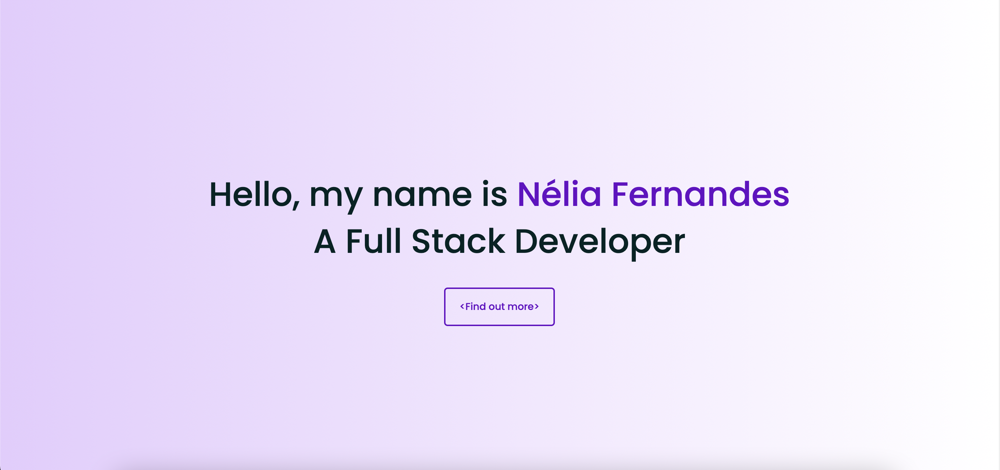

<h2 align="center">
  Portfolio
</h2>

 This is a webpage with students' presentation, projects and contacts using HTML and CSS. 

<h3> Attention! </h3>

This project uses SCSS for it's CSS. You need to run <code>npm run scss</code> to convert .scss files to .css files.

